# OPL PC Tools

OPL PC Tools is a set of desktop utilities for working with
[Open PS2 Loader](https://github.com/ifcaro/Open-PS2-Loader) storages.
It’s built with Qt and runs on both Linux and Windows.

The application helps you organize and manage your OPL game library.
You can browse your collection, assign custom images to games, and automatically
download covers from the Internet — either for a single title or your entire library at once.

It supports installing multiple games in sequence from various sources,
including CD/DVD discs and files in formats like *ISO*, *BIN*, *NRG*, or *ZSO*.
You can also convert games between formats (ISO, ZSO, UL) or rebuild an *ISO* file from an already installed game.

OPL PC Tools makes it easy to import games from other OPL storage locations,
adjust individual game settings, and use cheats — including automatic downloading of widescreen patches.
The tool also provides full support for virtual memory cards, allowing you to create, read, and write VMC files.

## This project uses

- [Qt](https://www.qt.io) – a cross‑platform application development framework;
- [LZ4](https://github.com/lz4/lz4) – extremely fast compression algorithm;
- A large collection of game art at [archive.org](https://ia903209.us.archive.org/view_archive.php?archive=/34/items/ps2-opl-cover-art-set/PS2_OPL_ART_kira.7z);
- A large collection of [widescreen cheats](https://github.com/PS2-Widescreen/OPL-Widescreen-Cheats).

## Screenshots

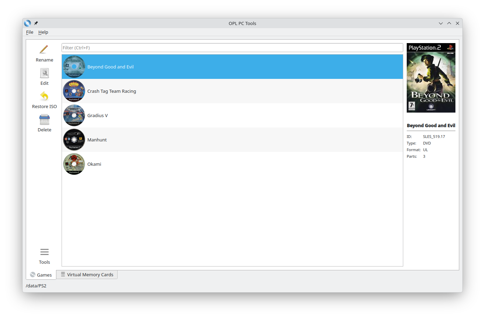

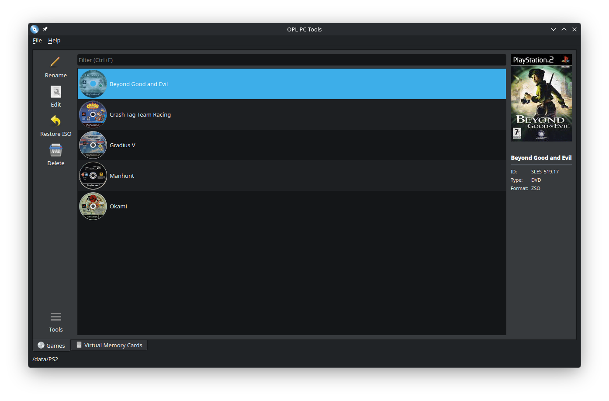

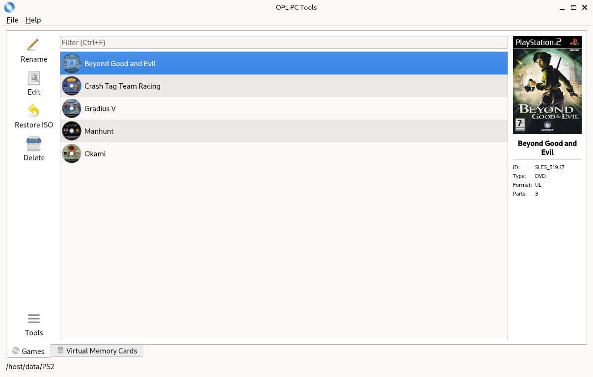

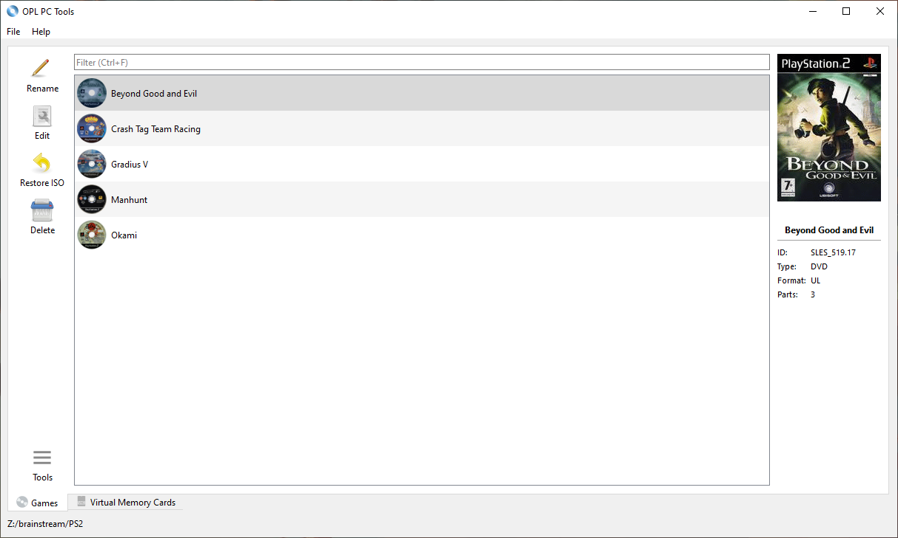

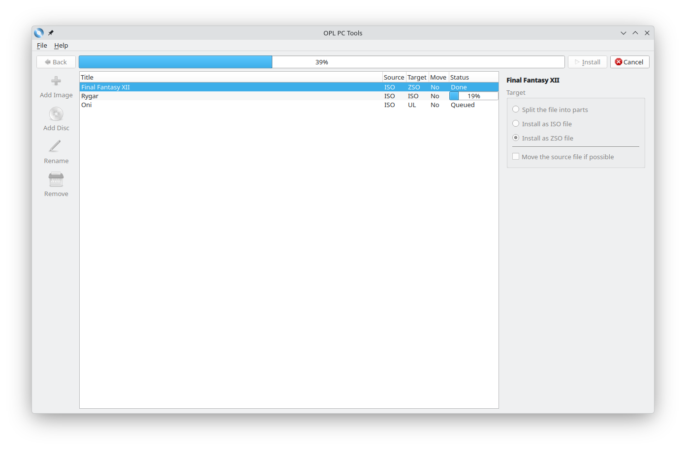

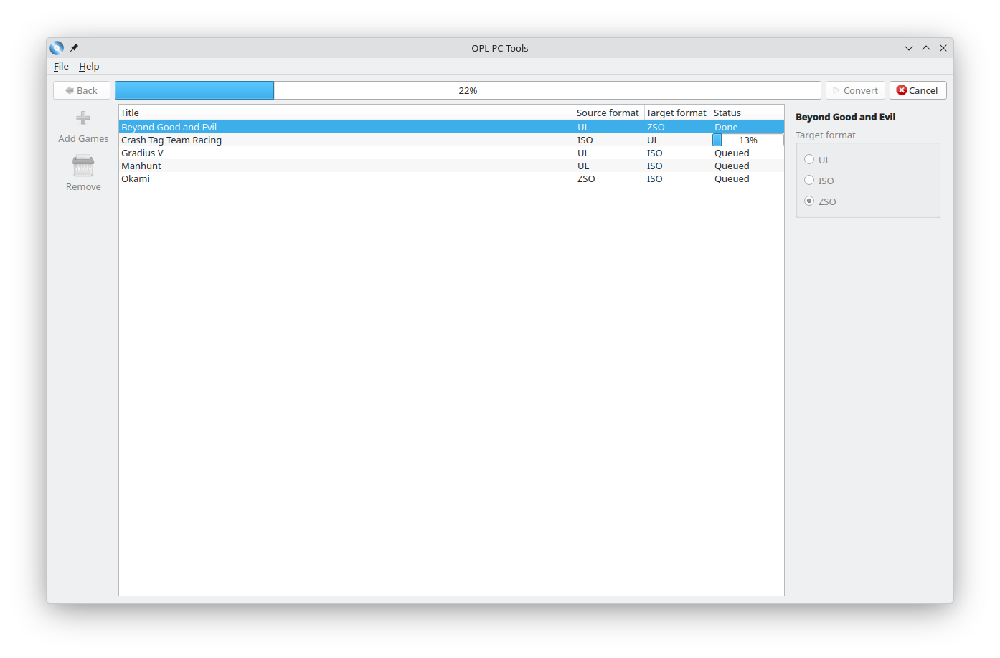

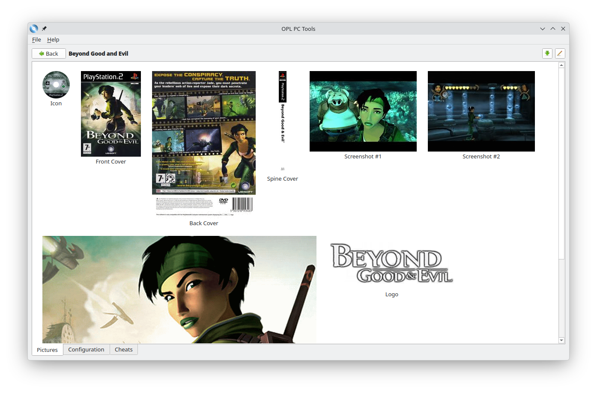

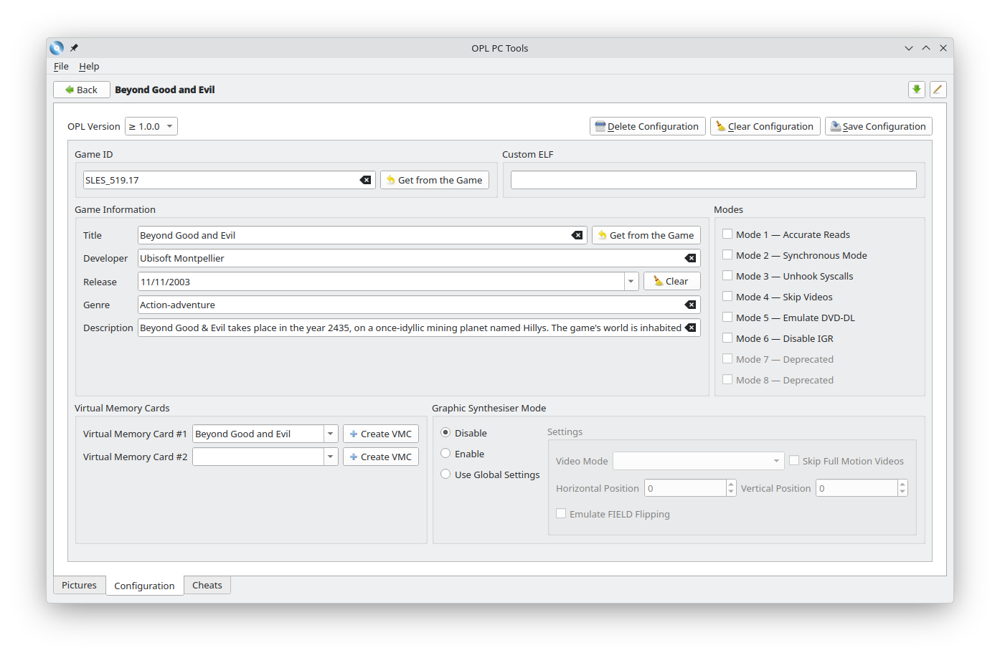

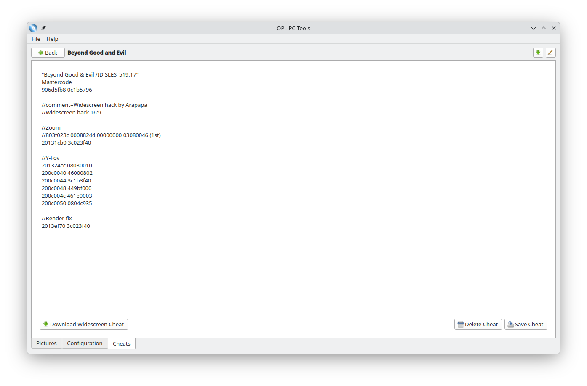

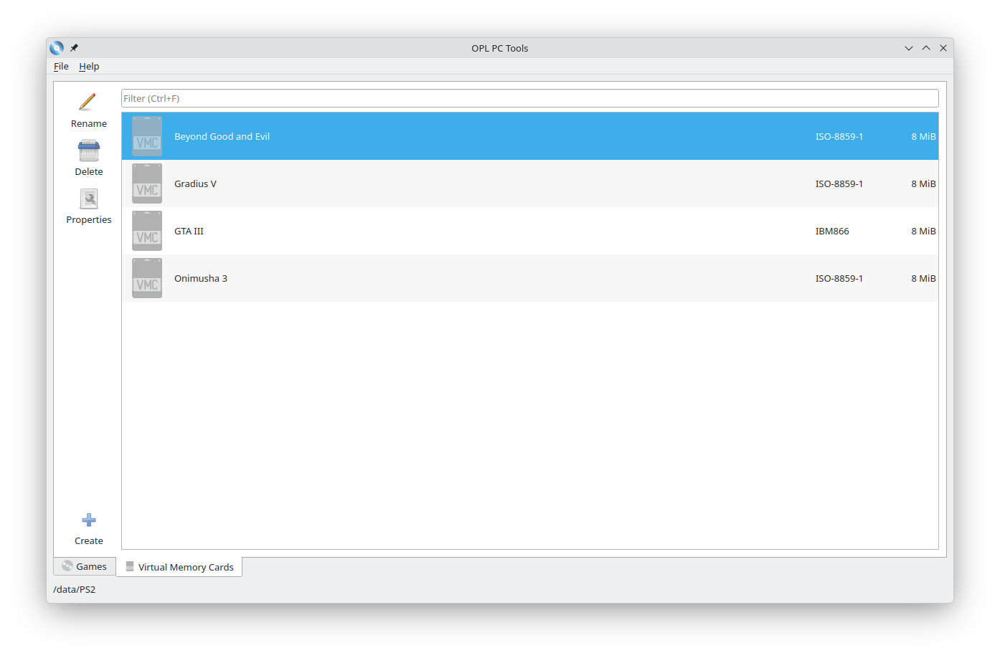

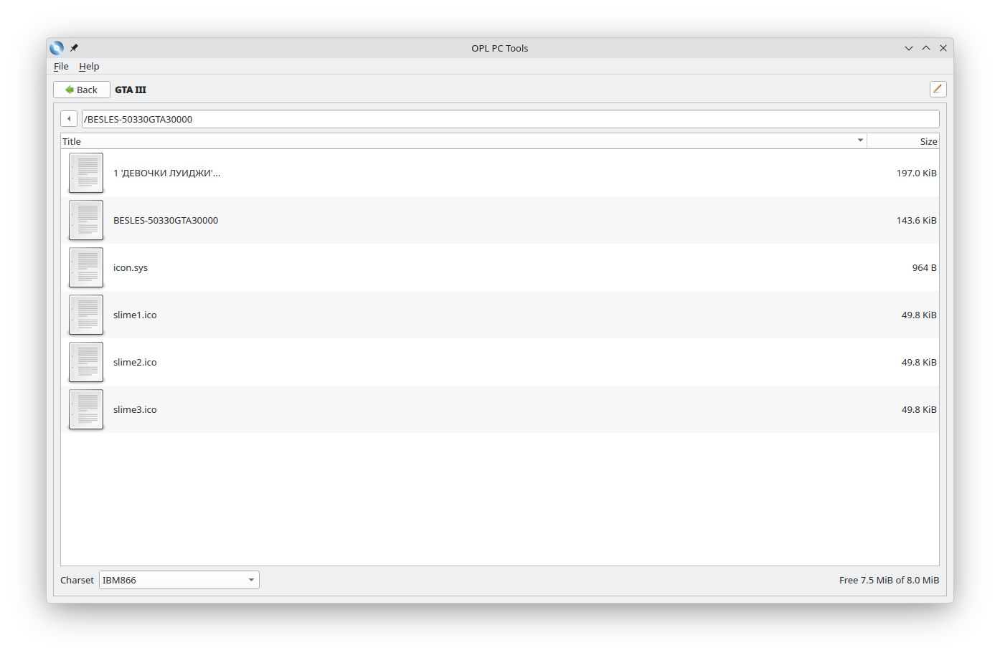
